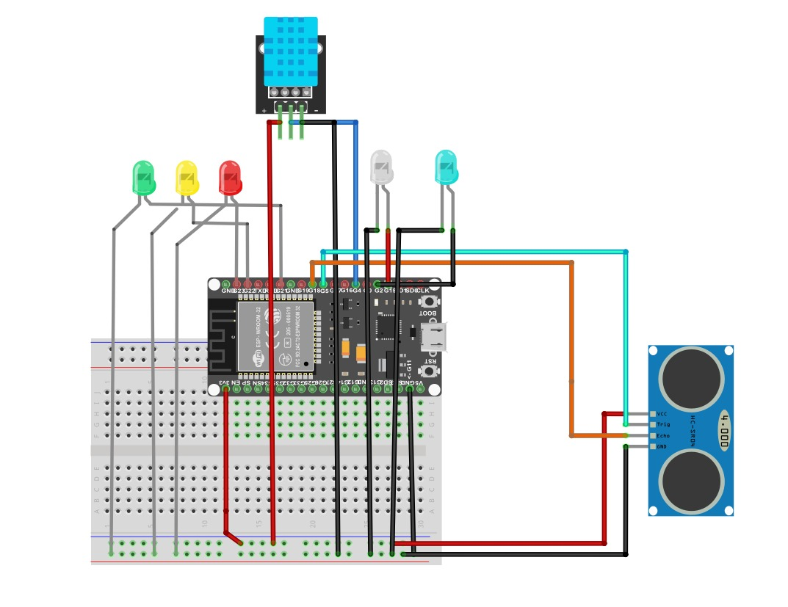

# SUBANDI

  

## 📰 Overview
* *SUBANDI* adalah Sistem Uji Banjir dan Deteksi Intensitas yang berfungsi untuk memonitoring ketinggian permukaan air dan intensitas hujan serta memberikan notifikasi secara real-time jika akan terjadi banjir.
-  *SUBANDI* bertujuan untuk memberikan peringatan dini jika akan terjadi banjir kepada masyarakat atau pihak terkait

## ❔ What Can SUBANDI Do?
* *SUBANDI* dapat mendeteksi ketinggian permukaan air dengan akurasi tinggi jika akan terjadi banjir
* Menampilkan data ketinggian permukaan air, suhu, kelembapam, dan lokasi pengamatan
* Memberi label saat tidak hujan dan banjir dengan Normal, saat hujan dengan Waspada, saat hujan dan banjir dengan Bahaya
* Memberikan data secara real-time serta memberikan notifikasi melalui Bot Telegram

## ⚡️ Wiring & Components
*SUBANDI* menggunakan beberapa komponen ini :
1. 1x ESP32
2. 1x Sensor DHT 11
3. 1x SR-04
4. 1x GPS Module
5. 5x LED (Putih, Biru, Merah, Kuning, Hijau)
6. 5x Resistor
7. ± 23x male/male jumper cable
8. 1x BreadBoard
9. 1x USB Cable
10. 1x Powerbank 9000mAh

## 🔧 Assembly

  

## 📚 Software & Library
* Streamlit
* Pandas/Numpy
* MQTT
* Joblib
* TinyGPS
* HardwareSerial
* UniversalTelegramBot
* AdaFruit
